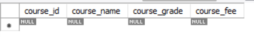

# Students Database Management Administartion
##  SQL_Queries-DDL(Data Definition Language)
1. CREATE a Table
```
CREATE DATABASE db1;           /*creating a databse as db1*/
USE db1;                      /*getting the acess to the database for Creating table*/  

CREATE TABLE Students ( 
    roll_number INT PRIMARY KEY,
    first_name VARCHAR(50),
    last_name VARCHAR(50),
    date_of_birth DATE,
    gender VARCHAR(10),
    email VARCHAR(100),
    phone_number VARCHAR(15)
);                             /*created a table for Students with diffrent coloumn name*/

```
Output:


```
CREATE TABLE Courses (
    course_id INT PRIMARY KEY,
    course_name VARCHAR(100),
    course_grade INT
    );                          /*created a table for Courses with diffrent coloumn name*/

```
Output:


```
CREATE TABLE Enroll (
    enroll_id INT PRIMARY KEY,
    roll_number INT,
    course_id INT,
    enroll_date DATE,
    FOREIGN KEY (roll_number) REFERENCES Students(roll_number),               
    FOREIGN KEY (course_id) REFERENCES Courses(course_id)
);                            /*created a table for Enroll with diffrent coloumn name and also created a refrences */
```
Output:


```
CREATE TABLE  Fees (
     course_id INT PRIMARY KEY,
     course_fee INT           
 );                            /*created a table for Fees with diffrent coloumn name*/
```
Output:


2. DROP a table
```
DROP TABLE Fees;            /*deleting a table completely form a database which cannot be retrive*/ 
```
Output:


3. ALTER a table
```
 ALTER TABLE Courses
 ADD course_fee INT;     /*Adding a coloumn to a table with the help of ALTER TABLE*/ 
```
Output:



```
ALTER TABLE Courses
DROP course_fee;       /*Droping a coloumn that is of no use*/
```
Output:


4. TRUNCATE a table
```
TRUNCATE TABLE Fees;      /*deleting a table and data inside completely form a database which can be backuped*/
```
Output:


## SQL_Queries-DML(Data Manipulation Language)
1. INSERT
```
                -- Insert data into 'students' table
INSERT INTO students (roll_number, first_name, last_name, date_of_birth, gender, email)
VALUES
  (202310, 'Venky', 'S', '1997-01-27', 'M', 'venky.s@gmail.com'),
  (202311, 'Lingaraj', 'Samantray','1996-11-12', 'M', 'lingaraj.samantray@gmail.com'),
  (202312, 'Asutosh', 'Padhy', '1999-08-07','M',  'asutosh.padhy@gmail.com'),
  (202313, 'Asutosh', 'Gouda', '1995-08-07','M',  'asutosh.gouda@outlook.com'),
  (202314, 'Sudip', 'Gouda', '1997-09-03','M',  'sudipgouda123@gmail.com'),
  (202315, 'Sumit', 'Pattnaik', '1997-04-07','M',  'sumit.pattnaik@gmail.com'),
  (202316, 'Sasmita', 'Sen', '1998-03-30','F',  'sasmita.sen@gmail.com'),
  (202317, 'Gayatri', 'Behera', '1997-03-25','F',  'gayatri.behera@gmail.com'),
  (202318, 'Venaktesh', 'G', '1990-04-27','M',  'venaktesh.g@gmail.com'),
  (202319, 'Sunil', 'Setthy', '1997-06-19','M',  'sunil.setthy@gmail.com');
```
Output:


                -- Insert data into 'courses' table
```
INSERT INTO courses (course_id, course_name, course_grade)
VALUES
  (101, 'Mathematics', 4),
  (102, 'History', 3),
  (103, 'Biology', 4),
  (104, 'English', 2),
  (105, 'Geography', 3),
  (106, 'Genaral Knowlegde', 3);
```
Output:


                   -- Insert data into 'enroll' table
```                   
INSERT INTO enroll (enroll_id, roll_number, course_id,enroll_date)
VALUES  (21501, 202314, 103, '2023-06-15'),
		(21502, 202319, 106, '2023-04-22'),
        (21503, 202310, 103, '2023-06-10'),
        (21504, 202318, 105, '2023-05-05'),
        (21505, 202316, 101, '2023-05-02'),
        (21506, 202311, 102, '2023-06-27'),
        (21507, 202312, 104, '2023-04-25'),
        (21508, 202315, 102, '2023-05-19');
```
Output:


