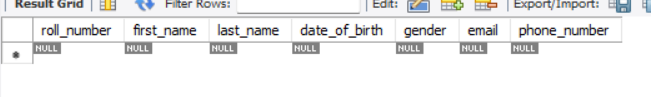

# SQL_QUERIES-DDL(Data Definition Language)
## for students database management administartion
```

CREATE DATABASE db1;           /*creating a databse as db1*/
USE db1;                      /*getting the acess to the database for Creating table*/  


CREATE TABLE Students ( 
    roll_number INT PRIMARY KEY,
    first_name VARCHAR(50),
    last_name VARCHAR(50),
    date_of_birth DATE,
    gender VARCHAR(10),
    email VARCHAR(100),
    phone_number VARCHAR(15)
);                             /*created a table for Students with diffrent coloumn name*/

```
Output:


```
CREATE TABLE Courses (
    course_id INT PRIMARY KEY,
    course_name VARCHAR(100),
    course_grade INT
    );                          /*created a table for Courses with diffrent coloumn name*/

```
Output:


```
CREATE TABLE Enroll (
    enroll_id INT PRIMARY KEY,
    roll_number INT,
    course_id INT,
    enroll_date DATE,
	FOREIGN KEY (roll_number) REFERENCES Students(roll_number),               
	FOREIGN KEY (course_id) REFERENCES Courses(course_id)
);                            /*created a table for Enroll with diffrent coloumn name and also created a refrences */
```
Output:


```
CREATE TABLE  Fees (
	course_id INT PRIMARY KEY,
    	course_fee INT           
 );                            /*created a table for Fees with diffrent coloumn name*/
```
Output:


```
